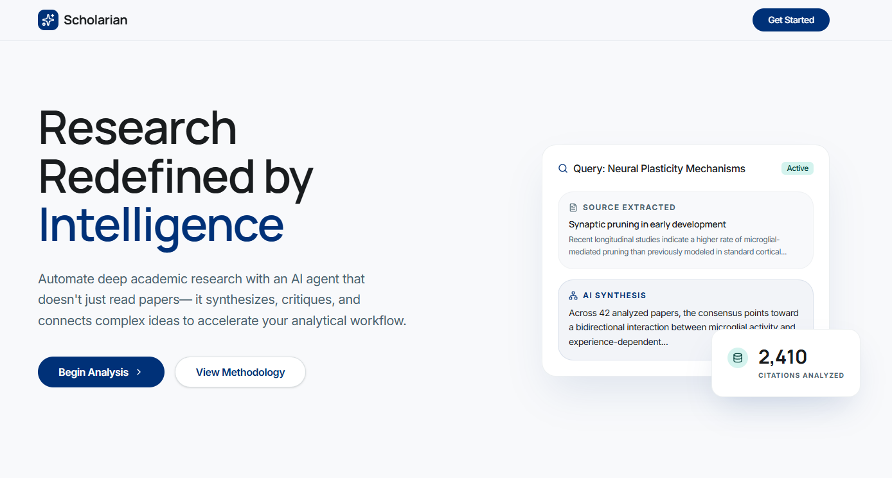

# Scholarian: Research Redefined by Intelligence

Scholarian is a high-end, editorial research platform designed to transform the traditional "dashboard fatigue" of academic tools into a focused, analytical journey. It replaces manual literature reviews with an intelligent pipeline that scours semantic databases, synthesizes multi-variable findings, and engages in context-aware interrogation.



## 🏛 The Architecture of Insight

Scholarian is built on three core pillars designed for exhaustive academic analysis:

### 1. Deep Paper Search
Bypass generic academic search engines. Our agent queries semantic databases across multiple disciplines, surfacing foundational papers and obscure pre-prints alike through high-precision vector spaces.

### 2. Automated Synthesis
Scholarian extracts core findings, methodologies, and data points from full texts, assembling them into a unified narrative that highlights both academic consensus and critical contradictions.

### 3. Context-Aware Interrogation
Engage in a dynamic dialogue with your curated library. Ask complex questions and receive citations anchored directly to the source text, ensuring every insight is verifiable.

---

## 🎨 The "Analytical Lens" Design System

Scholarian follows a unique design philosophy we call **The Analytical Lens**.

- **Editorial Layout**: Moving away from complex spreadsheets toward a high-fidelity, readable editorial layout.
- **Micro-interactions**: Subtle hover effects and state transitions (like the Research Pipeline progress indicators) that provide immediate, premium feedback.
- **Premium Aesthetics**: A custom-curated color palette (Surface, On-Surface, Primary) and modern typography (Cabinet Grotesk / Inter) optimized for long-form reading and analysis.

---

## 🛠 Tech Stack

- **Framework**: [Next.js 16](https://nextjs.org/) (App Router, Turbopack)
- **Styling**: [Tailwind CSS](https://tailwindcss.com/) with a custom design system
- **Icons**: [Lucide React](https://lucide.dev/)
- **Components**: [Base UI](https://base-ui.com/) & Radix-inspired custom builders
- **Language**: [TypeScript](https://www.typescriptlang.org/)

---

## 🚀 Getting Started

First, install the dependencies using `pnpm`:

```bash
pnpm install
```

Then, run the development server:

```bash
pnpm dev
```

Open [http://localhost:3000](http://localhost:3000) with your browser to explore the landing page and the authentication flow.

---

## 🗝 License

Copyright © 2026 Scholarian AI. Distributed under the MIT License. Precision in every insight.
